# OpenCode UltraCode System — UML State Machine Diagram

> **Target reader:** A curious 12-year-old who learns visually.
> **Goal:** Zero information loss — the diagrams plus the architecture doc should make you understand everything.
> **Format:** Mermaid.js state diagrams (render in any markdown viewer that supports Mermaid).
> **Rule:** We never delete, only add.

---

## 📖 Diagram Index

1. [Overall System Flow (Top Level)](#1-overall-system-flow-top-level)
2. [Gate Enforcement State Machine](#2-gate-enforcement-state-machine)
3. [Workflow Executor States](#3-workflow-executor-states)
4. [Simulation Engine States](#4-simulation-engine-states)
5. [Full Pipeline (Single Task)](#5-full-pipeline-single-task)
6. [Permission System Flow](#6-permission-system-flow)
7. [Compaction Pipeline](#7-compaction-pipeline)
8. [Agent Lifecycle](#8-agent-lifecycle)
9. [Interview System Flow](#9-interview-system-flow)
10. [Report Generation Flow](#10-report-generation-flow)

---

## 1. Overall System Flow (Top Level)

This shows the ENTIRE system as one big state machine with orthogonal (parallel) regions.

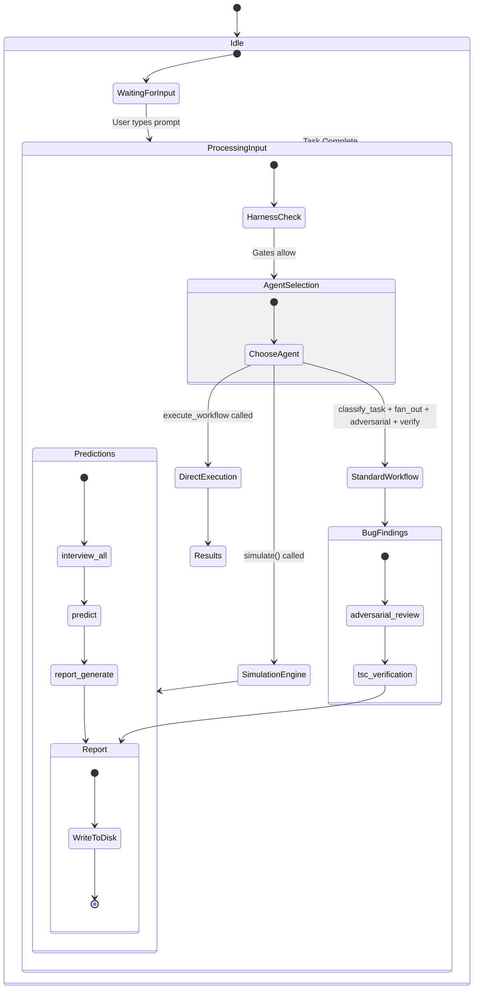

**What this shows:** Every task goes through a harness check, then one of three paths (standard workflow, simulation, or direct execution), then produces a report. The system always returns to idle waiting for the next input.

---

## 2. Gate Enforcement State Machine

This is the MOST IMPORTANT diagram. It shows how each of the 5 gates works.

Each gate has the same pattern: **Guide 3x → Force**. This diagram shows ONE gate. All 5 gates work the same way.

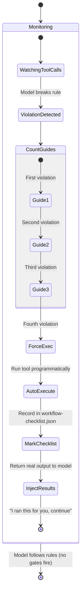

### Example: Gate 3 (fan_out)

Let's trace through a real example:

```
Read 1: src/auth/token.ts      → guide 1 (no action)
Read 2: src/auth/session.ts    → guide 2 (no action)
Read 3: src/auth/roles.ts      → guide 3 (no action)
Read 4: src/auth/permissions.ts → FORCE! Auto-execute fan_out
                                 → Scan 308 files
                                 → Group by extension
                                 → Return file tree
                                 → Tell model "continue"
```

**What the model sees:**
```
[AUTO] fan_out EXECUTED. 308 files found.
Breakdown: json: 162, ts: 98, md: 2...
File tree:
  .json (8+): ...
  .ts (8+): ...

Scan these files in parallel. fan_out is complete.
```

---

## 3. Workflow Executor States

This shows `execute_workflow()` — the tool that spawns REAL agents.

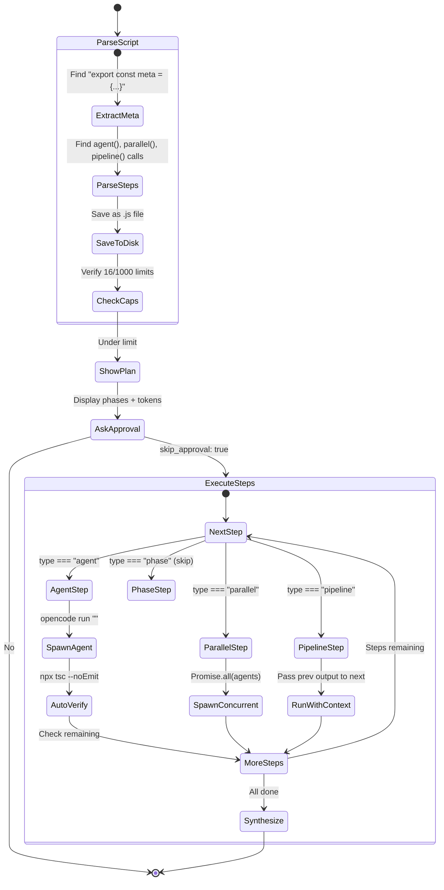

### The 3 Loop Modes

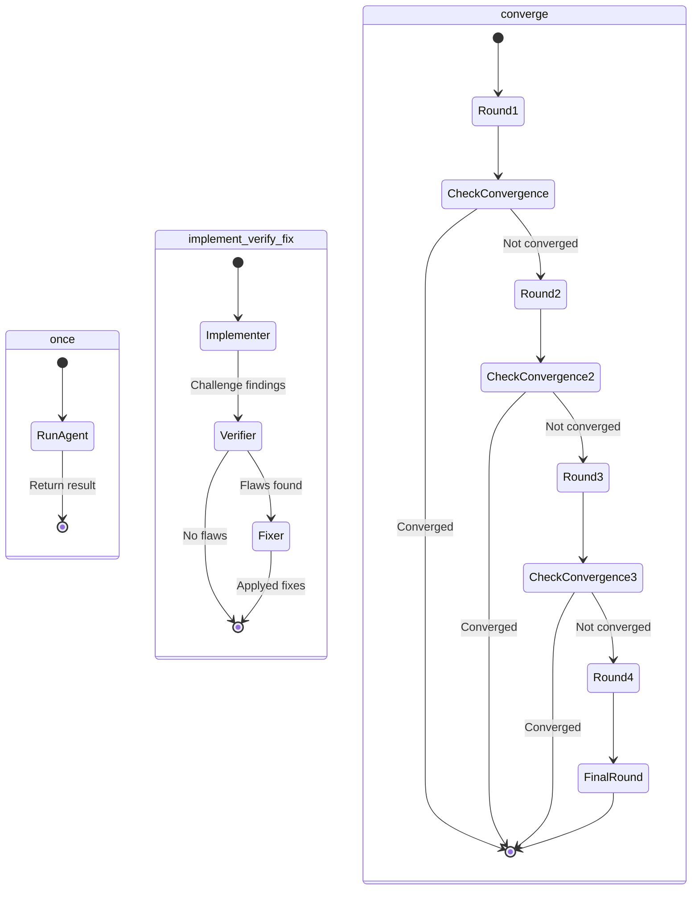

---

## 4. Simulation Engine States

This shows `simulate()` — the multi-agent debate system.

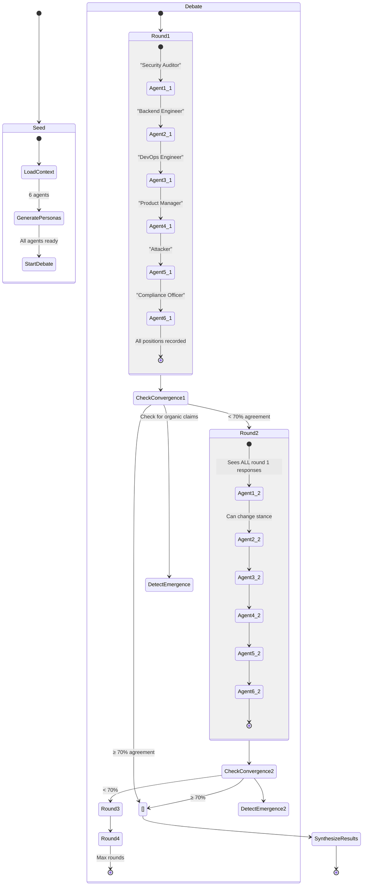

### Position State Machine (Per Agent)

Each agent goes through this during debate:

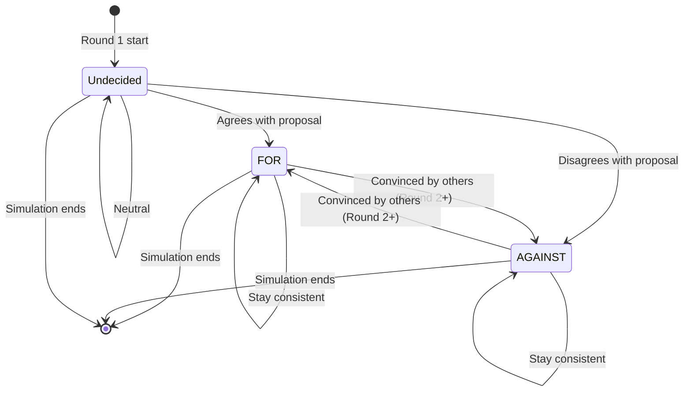

---

## 5. Full Pipeline (Single Task)

This traces what happens when the user says: "Find bugs and simulate a debate on the top findings."

```mermaid
stateDiagram-v2
    [*] --> classify_task
    classify_task --> fan_out: "ANALYSIS → Loop Until Done"
    fan_out --> ReadFiles: 6 subtasks dispatched
    
    ReadFiles --> Gate3Check: Read 4+ files
    Gate3Check --> ReadMore: Under 4 reads
    Gate3Check --> AutoFanOut: 4th+ read → auto fan_out
    
    ReadMore --> FindVulnerabilities
    
    state FindVulnerabilities {
        [*] --> JWTSecrets: Found!
        JWTSecrets --> BrokenCrypto: Found!
        BrokenCrypto --> MassAssignment: Found!
        MassAssignment --> SQLInjection: Found!
        SQLInjection --> PathTraversal: Found!
        PathTraversal --> [*]: 10+ findings
    }
    
    FindVulnerabilities --> Gate5Check: 5+ reads
    Gate5Check --> adversarial_review: Model calls it
    Gate5Check --> AutoAdversarial: Model didn't call it
    
    adversarial_review --> tscVerification
    
    tscVerification --> permission_ask: npx tsc --noEmit
    permission_ask --> AutoApprove: "Safe verification command"
    AutoApprove --> TSCResults: Compilation errors found
    
    TSCResults --> simulate: "6 personas debate top 3 findings"
    
    state simulate {
        [*] --> Round1
        Round1 --> Round2
        Round2 --> Converged
        Converged --> Emergence
        Emergence --> [*]
    }
    
    simulate --> interview_all: "Interview every agent"
    interview_all --> predict: "Final verdict"
    
    predict --> report_generate: "Full audit report"
    report_generate --> WriteReport: SECURITY_AUDIT_REPORT.md
    WriteReport --> [*]
```

---

## 6. Permission System Flow

This shows how `permission.ask` works.

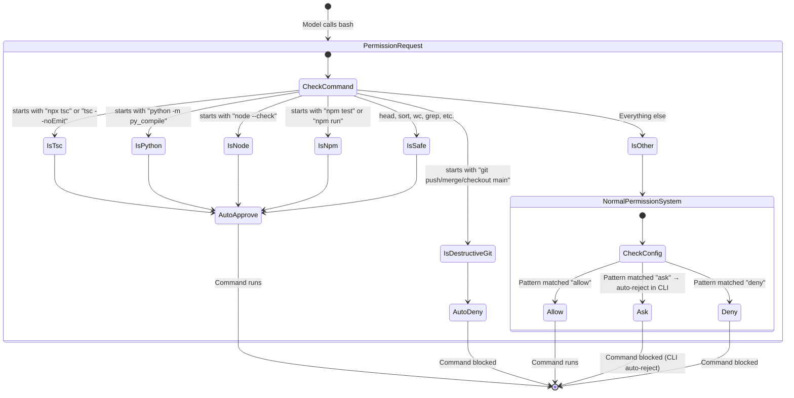

**The key insight:** The `permission.ask` hook runs BEFORE the normal permission system. It short-circuits the check entirely for known-safe commands. The normal permission system only runs for "Other" commands.

---

## 7. Compaction Pipeline

This shows the 5-stage compaction that runs when context gets full.

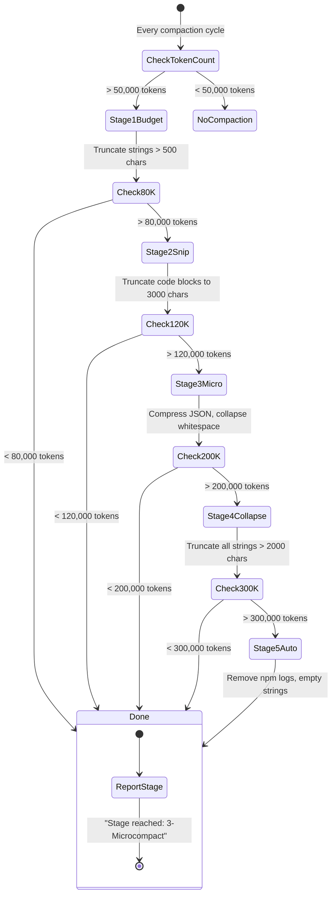

---

## 8. Agent Lifecycle

Every agent spawned by the system goes through these states:

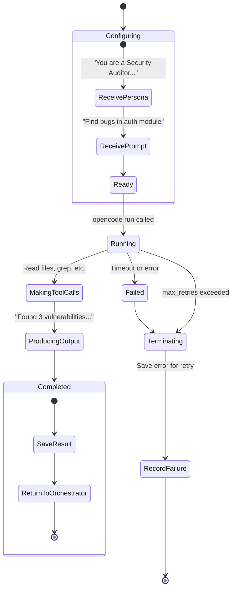

---

## 9. Interview System Flow

After a simulation, you can interrogate any agent:

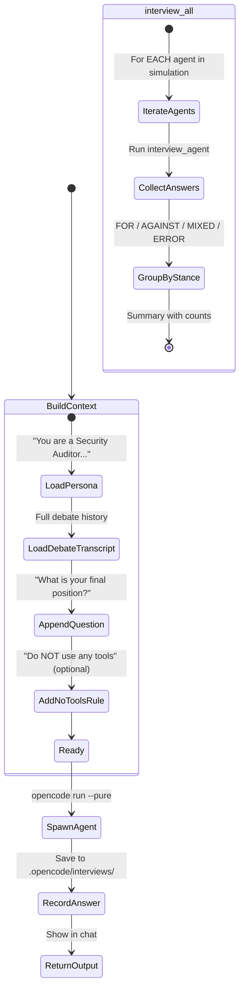

---

## 10. Report Generation Flow

The ReACT (Reasoning + Acting) report generation:

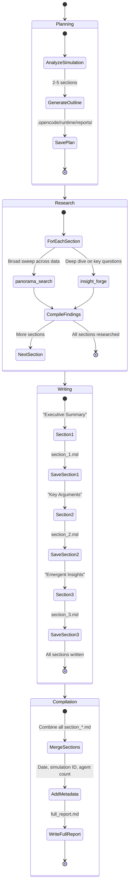

---

## Appendix: How to Read These Diagrams

### State Machine Basics

```
┌──────────────────────┐
│     State Name       │  ← A rounded box is a STATE
│                      │     (something is happening or waiting)
└──────────────────────┘
         ↓                    ← An arrow is a TRANSITION
         ↓                       (something triggers the change)
    ┌──────────┐
    │ Next State│
    └──────────┘

[*] → State     ← The START arrow (where everything begins)
State → [*]     ← The END arrow (where everything finishes)

state Parent {
    [*] → Child   ← A COMPOSITE state (contains sub-states)
}                   (the parent runs its children in order)
```

### Orthogonal Regions

When you see `state` and `state` side by side inside a parent, they run in PARALLEL (at the same time). This is an "orthogonal region."

### Reading the Gate Diagram

```
Start → Monitoring
        Monitoring sees violation → Count 1, 2, 3 (guide)
        On count 4 → Force → Auto-execute → Mark checklist → Continue
```

This means: The gate watches. When the model breaks a rule, it counts 1, 2, 3 (guiding each time). On the 4th time, it forces the action. Then it marks the checklist and tells the model to continue.
